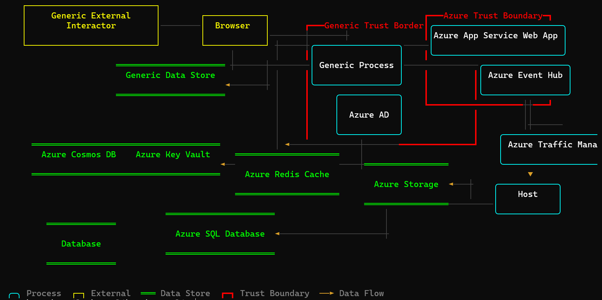

# tm7 CLI

A command-line tool for constructing, interrogating, and modifying Microsoft Threat Modeling Tool (`.tm7`) files — designed for use by humans and AI assistants alike.

## Features

- **Open & inspect** — summarize models, list entities and data flows
- **Create & modify** — add/remove entities and flows, create new models from templates
- **Import** — convert Graphviz DOT diagrams into `.tm7` format
- **Render** — visualize threat model diagrams directly in the terminal with Unicode box-drawing and ANSI colors
- **Round-trip fidelity** — uses `DataContractSerializer` with DTO classes matching the TM7 XML format

## Install

Requires [.NET 10 SDK](https://dotnet.microsoft.com/download/dotnet/10.0).

```bash
# Clone and build
git clone <repo-url>
cd tm7cli
dotnet build

# Run directly
dotnet run --project src/Tm7.Cli -- <command>

# Or install as a global tool
dotnet pack
dotnet tool install --global --add-source artifacts/package/release tm7
tm7 --help
```

## Quick start

```bash
# Inspect a model
tm7 open model.tm7
tm7 list entities model.tm7
tm7 list flows model.tm7

# Create a new model from the included template
tm7 new mymodel.tm7 --template samples/template.tm7 --name "My Threat Model"

# Add entities
tm7 add entity mymodel.tm7 \
  --name "Web API" \
  --type-id SE.P.TMCore.AzureAppServiceWebApp \
  --generic-type-id GE.P \
  --left 400 --top 200

# Add a data flow (use GUIDs from 'list entities')
tm7 add flow mymodel.tm7 \
  --name "HTTPS Request" \
  --source <source-guid> \
  --target <target-guid>

# Render the diagram in terminal
tm7 render mymodel.tm7

# Import from Graphviz DOT
tm7 import dot architecture.dot --output model.tm7 --template samples/template.tm7

# Show all usage examples
tm7 examples
```

## Commands

| Command | Description |
|---------|-------------|
| `open <file>` | Show model summary (surfaces, entity/flow counts, threats) |
| `list entities <file>` | List all entities with type, position, surface |
| `list flows <file>` | List all data flows with source/target |
| `add entity <file>` | Add an entity (process, external interactor, data store, boundary) |
| `add flow <file>` | Add a data flow between two entities |
| `remove entity <file>` | Remove an entity and its connected flows |
| `remove flow <file>` | Remove a data flow |
| `new <file>` | Create an empty model from a template |
| `import dot <dotfile>` | Import a Graphviz DOT file into tm7 format |
| `render <file>` | Render the diagram in the terminal |
| `examples` | Show usage examples and entity type reference |

## Entity types

| GenericTypeId | Shape | Example TypeIds |
|---------------|-------|-----------------|
| `GE.P` | ╭─╮ Process (ellipse) | `SE.P.TMCore.AzureAppServiceWebApp`, `SE.P.TMCore.AzureAD`, `SE.P.TMCore.Host` |
| `GE.EI` | ┌─┐ External Interactor (rectangle) | `SE.EI.TMCore.Browser`, `GE.EI` |
| `GE.DS` | ═══ Data Store (parallel lines) | `SE.DS.TMCore.AzureStorage`, `SE.DS.TMCore.AzureSQLDB`, `SE.DS.TMCore.AzureKeyVault` |
| `GE.TB.B` | ┏━┓ Trust Boundary (bold border) | `SE.TB.TMCore.AzureTrustBoundary`, `GE.TB.B` |

## Terminal rendering

The `render` command produces a Unicode diagram with ANSI color support:



- **Processes**: cyan rounded boxes (`╭╮╰╯`)
- **External Interactors**: yellow sharp boxes (`┌┐└┘`)
- **Data Stores**: green parallel lines (`═══`)
- **Trust Boundaries**: red bold borders (`┏┓┗┛`)
- **Data Flows**: gray lines with colored arrows (`►◄▼▲`)
- **Annotations**: dim gray text

Options: `--width`, `--height`, `--plain` (no ANSI codes, for piping/AI consumption).

### Key design decisions

- **Serialization**: Uses `DataContractSerializer` with an explicit known-types list — this is the only reliable way to produce valid `.tm7` files
- **DTOs**: The `Tm7Model/` directory contains DataContract DTO classes derived from the public `.tm7` XML format. They use explicit `[DataContract(Namespace = "...")]` attributes to match the XML namespaces that `DataContractSerializer` expects.
- **Rendering**: Uses [Hex1b](https://github.com/mitchdenny/hex1b) `Surface` as a character-cell canvas, with custom ANSI output to handle the unwritten-cell marker (`\uE000`)
